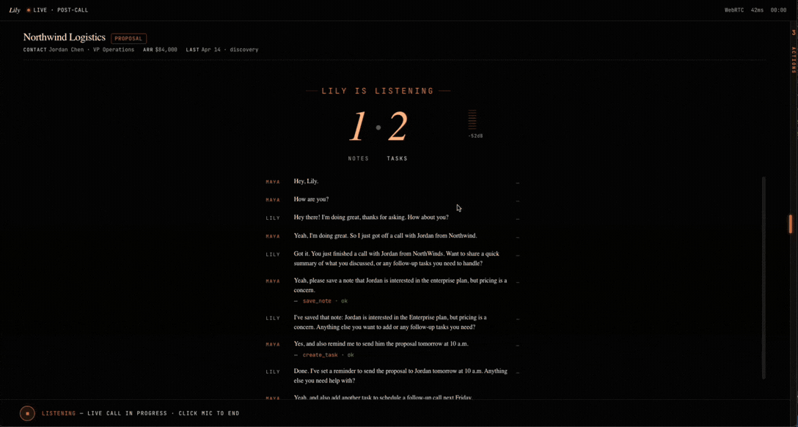

# Lily — Voice-first sales assistant



A real-time voice agent that helps sales reps capture post-call notes and create follow-up tasks through natural conversation. Built as a design engineering case study.

**Live demo:** https://voice-first-chat.vercel.app

**Video walkthrough:** [Watch on Canva](https://canva.link/tho9f525sd9r17d)

---

## What it does

Sales reps just got off a call. They have 5 minutes before the next one. Instead of opening Salesforce and typing notes, they press the mic button and talk:

> "Save a note that Jordan is interested in the enterprise plan but pricing is a concern. Remind me to send him the proposal tomorrow at 10am."

Lily captures structured notes, creates follow-up tasks, and answers questions about prior calls — all in real-time speech.

---

## How to run

Requires Node 18+ and an OpenAI API key with Realtime API access.

```bash
git clone https://github.com/baidiwang/voice-first-chat.git
cd voice-first-chat
npm install

# create .env.local
echo "OPENAI_API_KEY=sk-proj-xxxxx" > .env.local

npm run dev
```

Open `http://localhost:3000`. Click the mic, allow microphone access, start talking.

---

## Stack

- Next.js 15 (App Router) + TypeScript
- Tailwind CSS v4 + shadcn/ui (Button component, design tokens)
- OpenAI Realtime API (`gpt-realtime`) over WebRTC
- Web Audio API for amplitude visualization
- Deployed on Vercel

---

## Additional goals addressed

- **Responsive layout** — desktop side drawer; mobile bottom sheet
- **Real-time transcription with trust cues** — interim text in italic gray, finalized in white; "live" indicator until Whisper confirms
- **Real tool integration** — `save_note`, `create_task`, `search_context` with mock backend:
  - `save_note` — capture structured post-call notes
  - `create_task` — create follow-up tasks with due dates
  - `search_context` — search prior customer/deal context
